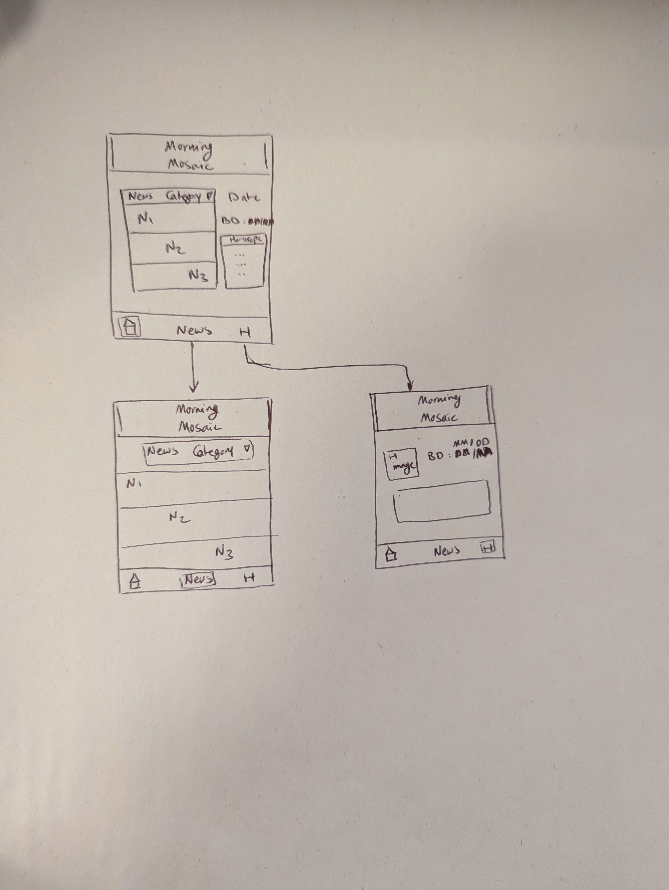

# **MORNING MOSAIC**

## Table of Contents

1. [App Overview](#App-Overview)
1. [Product Spec](#Product-Spec)
1. [Wireframes](#Wireframes)
1. [Build Notes](#Build-Notes)

## App Overview

### Description 

It would be a morning app for people to wake up, look at their horoscope, and see some news while they are starting their day. This app could appeal to a wide variety of people, maybe those who miss the old newspaper experience of having different columns next to eachother. The two API's for the news and the horoscope seem pretty straightforward to use, and even if we get half of the project working, it will work for our assignment. 

### App Evaluation

<!-- Evaluation of your app across the following attributes -->

- **Category:** News + Astrology App
- **Mobile:** We usually look at our phones first thing in the morning, so it makes sense to have this be a mobile app
- **Story:** The app can prevent users from being bogged down by lots of information first thing in the morning, by only providing a brief horoscope and a few relevant articles. 
- **Market:** Mobile users who love to start their days getting updated about the world by reading interesting news about politics, celebrities,... and prediction about their horoscope for a day to have fun, read daily horoscopes, and discuss astrological insights with friends or colleagues.
- **Habit:** The app is for user consumation not creation. The user might use the app every morning or once a day. 
- **Scope:**

## Product Spec

### 1. User Features (Required and Optional)

Required Features:

- **Scrollable view**
- **Ability to display multiple articles + images at once**
- **User can set preferences for news categories and birthday for astrology with user input**
- **Ability to get updated information with API calls**
- **Use consistent custom styling**

Stretch Features:

- **Uses two API's**
- **Allows user to customize their experience**

### 2. Chosen API(s)

- **Mediastack News REST API** (Link: [News API](https://))
  
  -  Delivering worldwide live and historical news data in handy JSON format
  -  Dislaying news title, data, news source, image,...
- **AstrologyAPI** (Link: [AstrologyAPI](https://www.astrologyapi.com/horoscope-api-docs/api-ref/75/sun_sign_prediction/daily/:zodiacName))

  - Displaying daily predictions for individuals based on their zodiac sign (various aspects of life: personal life, profession, health, travel, luck, and emotions)
 
### 3. User Interaction

Required Feature

- **User can enter their birth day and month to view the horoscope**
  - **The app will be able to show the user their horscope**
  - Using TextView
- **User can select a category or multiple categories of news to view**
  - **The app will give the user a scrollable view of three news stories that are within the categories that are selected**
  - RecyclerView

## Wireframes

<!-- Add picture of your hand sketched wireframes in this section -->

## Build Notes

We learned that using most APIs is really complicated.  

For Milestone 2, include **2+ Videos/GIFs** of the build process here!

## License

Copyright **2023** ****

Licensed under the Apache License, Version 2.0 (the "License");
you may not use this file except in compliance with the License.
You may obtain a copy of the License at

    http://www.apache.org/licenses/LICENSE-2.0

Unless required by applicable law or agreed to in writing, software
distributed under the License is distributed on an "AS IS" BASIS,
WITHOUT WARRANTIES OR CONDITIONS OF ANY KIND, either express or implied.
See the License for the specific language governing permissions and
limitations under the License.